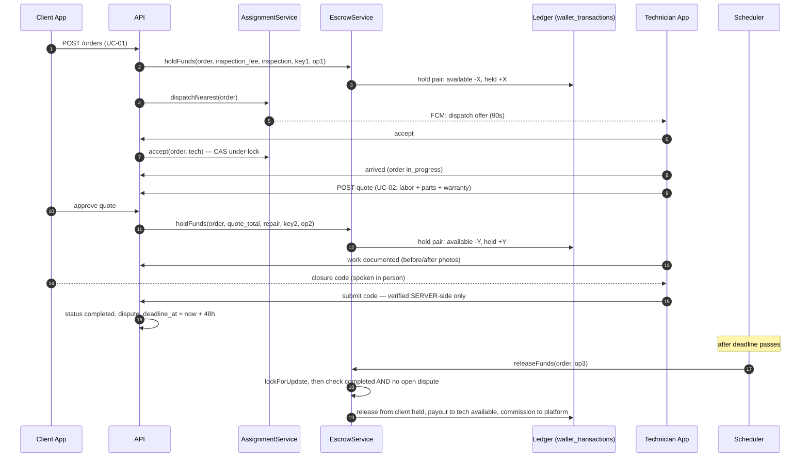
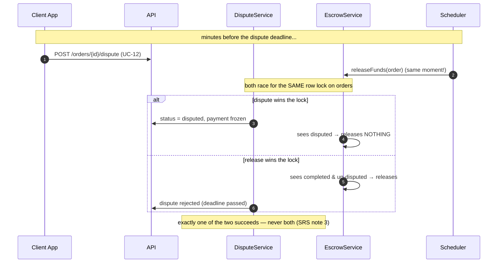

# Money & Order Flows

GitHub renders these diagrams automatically. They show WHERE each
`EscrowService` method is called in the order lifecycle.

## Happy path: urgent order → repair → release

## Dispute path: the race EscrowService must win

## Where each EscrowService method fires

| Method | Called from | Trigger |
|---|---|---|
| `holdFunds` (inspection) | OrderController@store | client confirms order (UC-01 step 3) |
| `holdFunds` (repair) | QuoteController@approve | client approves quote (UC-02) |
| `holdFunds` (addon) | QuoteController@approve | client approves addon quote |
| `releaseFunds` | Scheduler releaseExpiredHolds | dispute window passed |
| `releaseFunds` | DisputeService@resolve | admin decides release_to_technician |
| `refund` (full) | DisputeService@resolve | admin decides full_refund |
| `refund` (partial) | DisputeService@resolve / cancel flow | partial_refund / late cancel split |
| `refund` (inspection) | AssignmentService | no technician found → fee returned |
